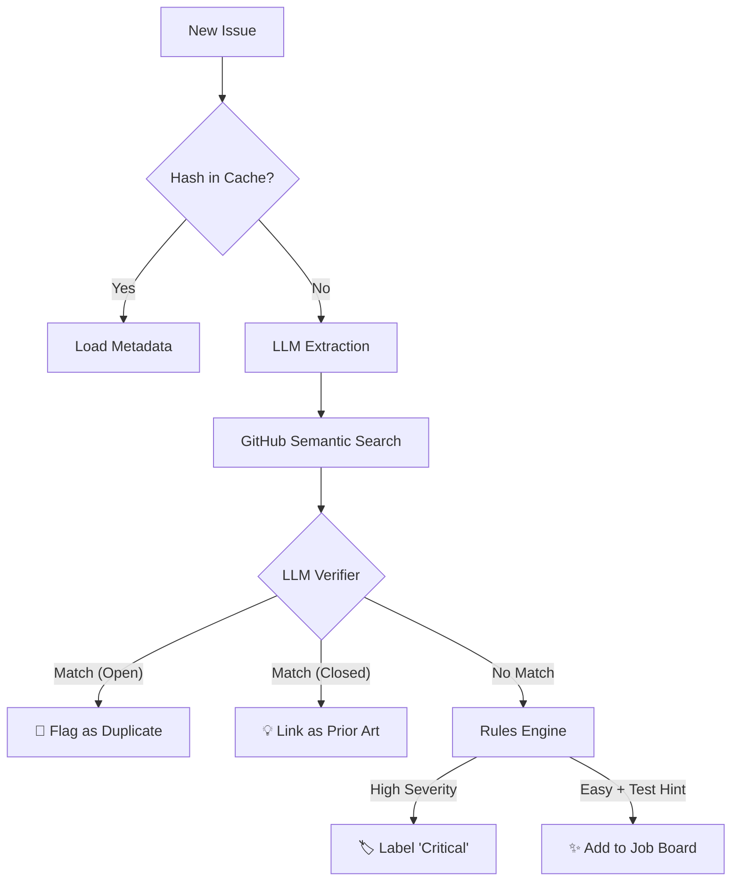
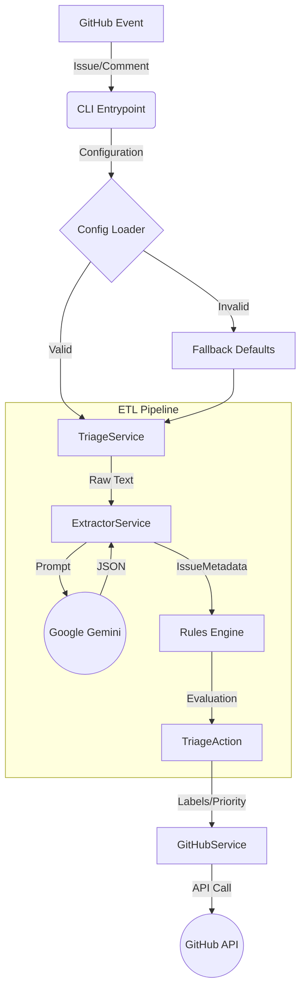

# Architecture: The Triage ETL Pipeline

This document details the engineering decisions behind the Triage Automation Engine. Unlike typical "chatbots," this system is designed as a **deterministic ETL (Extract, Transform, Load) pipeline**.

## The Philosophy

We treat GitHub Triage as a data engineering problem, not a conversational AI problem.
*   **Input**: Unstructured text (Issue Title, Body, Logs).
*   **Process**: Structural extraction followed by deterministic logic.
*   **Output**: Structured state changes (Labels, Priority Scores).

## The Pipeline



## System Diagrams



## 1. Extract (The Intelligence Layer)
**Component:** `ExtractorService` (`app/services/extractor.py`)

This is the only place where Probabilistic AI (LLMs) is used.
*   **Goal**: Convert unstructured human text into a strict Schema (`IssueMetadata`).
*   **Mechanism**:
    *   Prompt Engineering: "Act as a QA Engineer..."
    *   Pydantic Validation: We explicitly `forbid` extra fields to ensure the LLM follows the contract.
    *   **Output**: A clean JSON object containing facts (`is_crash`, `logs_provided`, `os`), not opinions.

### Phase 2: Transform (The "Deterministic" Layer)
**Component:** `TriageService` (`app/services/triage.py`)

Once we have facts, we do **not** want an AI deciding policy. Policy should be code/configuration.
*   **Goal**: Apply business logic to facts.
*   **Mechanism**:
    *   We use `json-logic`, a data format for writing rules.
    *   Rules are defined in `rules.yaml`.
    *   **Example**: `IF (is_crash=True OR is_blocker=True) THEN Priority=5`.
*   **Benefit**: This is unit-testable and version-controlled. If a rule is wrong, you fix the YAML, not prompts.

### Phase 3: Load (The "Effector" Layer)
**Component:** `GitHubService` (`app/services/github_service.py`)

*   **Goal**: Apply the state change to the source system.
*   **Mechanism**:
    *   Applies Labels (e.g., `bug`, `critical`).
    *   (Optional) Posts a comment explaining *why* the decision was made, referencing the specific rule that triggered.

## Data Contracts

### IssueMetadata (The Fact)
```python
class IssueMetadata(BaseModel):
    issue_type: Literal["bug", "feature", "question"]
    is_crash: bool
    sentiment_score: float
    # ...
```

### TriageAction (The Decision)
```python
class TriageAction(BaseModel):
    priority_score: int
    labels: List[str]
    reasoning: str
```
