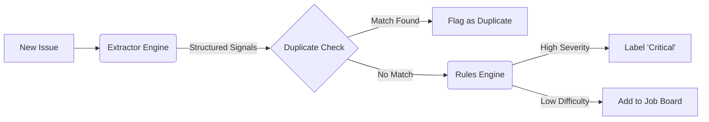

# IssueOps ⚡

[](https://github.com/marketplace/actions/issueops)
[](https://github.com/actions/toolkit/actions/workflows/main.yml)
[](LICENSE)

**Governance as Code for GitHub Issues.**

IssueOps treats your issue tracker like a production pipeline. It uses a deterministic AI engine to triage bugs, detect semantic duplicates, and curate "Good First Issues" for contributors—all defined in a simple YAML config.

---

## 🧠 How It Works

IssueOps is **not** a chatbot. It is a deterministic ETL pipeline for your backlog:



*   **Extract**: LLMs convert messy text into structured data (Severity, Stack Traces, Skills).
*   **Compare**: Checks against existing issues using semantic search (No Vector DB required).
*   **Decide**: Applies your rules.yaml logic to label, assign, or prioritize.

### 🚀 Key Features

*   **🛡️ Smart Caching ("The Wallet Saver")**: Uses content-addressable hashing (SHA-256) to skip re-analysis of unchanged issues, reducing LLM costs by ~90%.
*   **🔍 Semantic Duplicate Detection**: Identifies duplicates even if the wording is different, using a "Stateless" Search+Verify approach.
*   **🌱 Contributor Portal**: Auto-generates a static `job_board.html` and `feed.xml` (RSS) to attract new contributors.
*   **⚙️ Governance as Code**: All logic is defined in a transparent YAML config.

### 🛡️ The "Polite Guest" Guarantee

We understand that automated tools can be scary. IssueOps adheres to strict safety protocols:

*   **No Rogue Actions**: We will never auto-close or auto-assign issues unless you explicitly enable those rules.
*   **Read-Only Safe**: By default, the tool only applies labels. It does not delete data.
*   **Confidence Gating**: If the AI is unsure (Confidence < 0.85), it defaults to "Needs Human Review" rather than making a wrong guess.

## 📦 Quick Start

Add this to `.github/workflows/triage.yml` in your repository.

```yaml
name: IssueOps Triage
on:
  issues:
    types: [opened, edited]
  schedule:
    - cron: '0 0 * * *' # Run nightly to catch stale issues

jobs:
  triage:
    runs-on: ubuntu-latest
    permissions:
      issues: write
      contents: write # Required for Job Board publishing
    steps:
      - uses: actions/checkout@v3

      # 1. Restore Cache (Critical for Performance)
      - name: Cache Triage Data
        uses: actions/cache@v3
        with:
          path: .triage_cache.json
          # Invalidate cache if the config changes, but keep data across runs
          key: triage-data-${{ github.repository }}-${{ hashFiles('.github/issueops.yaml') }}
          restore-keys: |
            triage-data-${{ github.repository }}-

      # 2. Run IssueOps
      - name: Run IssueOps
        uses: anmolsen/issueops@v1
        with:
          gemini_api_key: ${{ secrets.GEMINI_API_KEY }}
          github_token: ${{ secrets.GITHUB_TOKEN }}
          mode: 'scan'
```

## ⚙️ Configuration (.github/issueops.yaml)

You can control exactly how IssueOps behaves. If no file is found, we use Safe Defaults (flagging crashes and security risks).

```yaml
# Example Configuration
rules:
  - name: "Critical Crash"
    condition:
      "or":
        - "==": [{ "var": "is_crash" }, true]
        - "==": [{ "var": "is_blocker" }, true]
    action:
      priority: 5
      labels: ["bug", "critical"]
      reasoning: "System crash detected."

  - name: "Good First Issue (Docs)"
    condition:
      "and":
         - "==": [{ "var": "difficulty" }, "easy"]
         - "==": [{ "var": "area" }, "docs"]
    action:
      priority: 1
      labels: ["good-first-issue", "documentation"]
```

## 🎨 The Contributor Job Board

Don't let "Good First Issues" get buried. IssueOps automatically generates a static portal for your community.

| Before (GitHub Default) | After (IssueOps Job Board) |
|:---:|:---:|
| Messy list of 50+ issues | Clean cards with "Python" and "Easy" tags |
|  |  |

## 🛠️ Local Development

For developers who want to contribute to IssueOps itself:

```bash
# 1. Install
pip install -r requirements.txt

# 2. Configure .env
cp .env.example .env

# 3. Run CLI
python -m app.cli.main scan --repo owner/repo --limit 5
```
